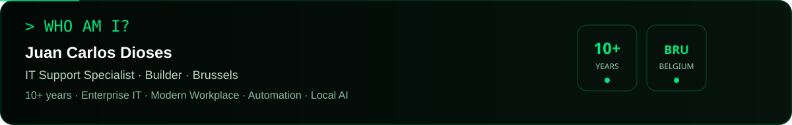
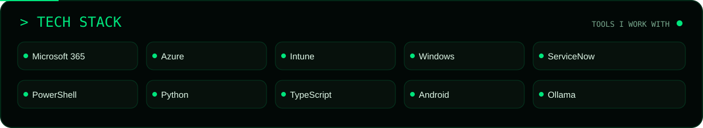
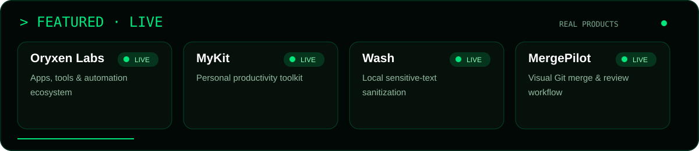
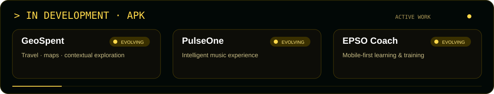
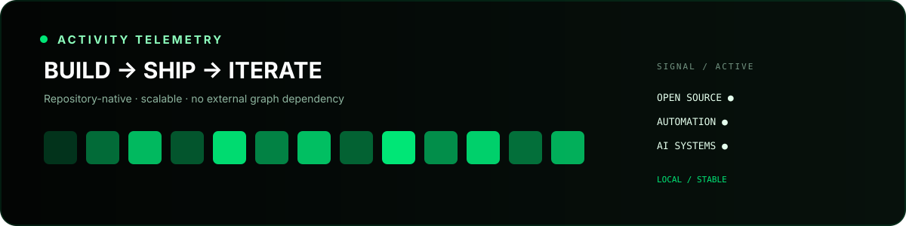

<div align="center">


[](https://oryxen.tech) [](https://www.linkedin.com/in/juan-dioses) [](https://github.com/antoleod?tab=repositories)

`SYSTEM ONLINE` · `BRUSSELS / BELGIUM` · `BUILDING USEFUL SYSTEMS`



## `01 / CAPABILITIES`


## `02 / DEPLOYED SYSTEMS`


**[ORYXEN LABS](https://oryxen.tech)** · **[MYKIT](https://oryxen.tech/mykit/)** · **[WASH](https://oryxen.tech/wash/)** · **[MERGEPILOT](https://oryxen.tech/pilot/)**

<sub>🟢 LIVE = externally reachable and usable</sub>

## `03 / ACTIVE BUILDS`


<sub>🟡 EVOLVING = active development / Android / APK · private internal systems are intentionally excluded.</sub>

## `04 / CREDENTIALS`
    

## `05 / ACTIVITY TELEMETRY`


<details><summary><b><code>06 / PUBLIC PAYOUT ENDPOINTS</code></b> — bounties & open-source work</summary>

> Public receive addresses only. Signing keys are never published. Verify the requested chain/token before sending.

| Network | Public receive address |
|:--|:--|
| **EVM** · Ethereum · Base · BNB · Optimism · Polygon | `0x6003FfB4c660bF4B13bf009559BbAba163676d9F` |
| **Algorand** | `7TLVBLJLK37GIOHCGSPJY5BD5IX5QUVIRRRVSEFWAX4KAAHDJ35R3TSS3A` |
| **Solana** | `Dnobewcqr1hbBr74cSjaUn8AVCu3gdLmCECnD68eLSBt` |
| **TRON** | `TAkB9RnnJdCsRHukN3oE5nihzjYkNnsm2i` |
| **Cardano** | `addr1qxrj0vl5qa5dk3r589qn4skk7gfdrx00qzaw07zdvmuex5u8y7elgpmgmdz8gw2p8tpddusj6xv77q96uluy6ehejdfs5vsx2g` |
| **Bitcoin** | `bc1qku9juk0pk2derxxnvy4mudy228vukvsmms22zn` |
</details>

```text
OBSERVE → BUILD → AUTOMATE → IMPROVE → SHIP → REPEAT
```

### `A MORE EFFICIENT TOMORROW STARTS WITH A USEFUL TODAY.`
<sub>ANTOLEOD · BUILD / AUTOMATE / SHIP</sub>
</div>
