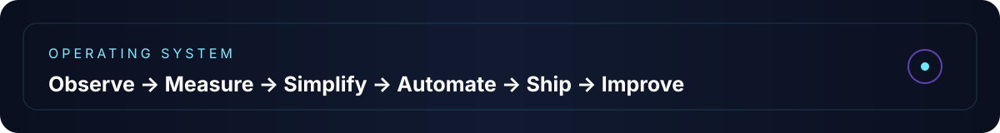

<div align="center">



<br/>

[](https://git.io/typing-svg)

[](https://github.com/antoleod?tab=followers)


</div>

## ⚡ I build practical systems, not demo-ware

I'm **Juan Carlos**, an IT specialist and developer based in Brussels. I like taking workflows that are slow, repetitive or unnecessarily complicated and turning them into tools people can actually enjoy using.

My work lives at the intersection of **enterprise IT, automation, local AI, developer tooling, Android and web products**. The common thread is simple: reduce friction, make behavior observable, keep the UX clean, and ship something useful.

<table>
<tr>
<td width="50%" valign="top">

### 🧠 AI + automation
Local-first agents, Ollama workflows, MCP integrations, safe tool execution and practical orchestration.

</td>
<td width="50%" valign="top">

### 🧰 Enterprise tooling
Service workflows, diagnostics, support automation, identity/device tooling and operator-first UX.

</td>
</tr>
<tr>
<td width="50%" valign="top">

### 📱 Product engineering
Android and web applications designed around speed, clarity, progressive loading and real-world usability.

</td>
<td width="50%" valign="top">

### 🔐 Reliability by design
Observability, measurable performance, secure defaults, fallback paths and systems that remain understandable.

</td>
</tr>
</table>

## 🚀 Current build universe

> A growing ecosystem of tools and products — each one focused on removing a specific kind of friction.

| System | Mission | Direction |
| --- | --- | --- |
| **Oryxen / MCP ecosystem** | Connect AI models to real tools with strong control and simple local deployment. | Local AI · agents · MCP · orchestration |
| **IT Toolkit** | Make enterprise support operations faster, clearer and less repetitive. | Service workflows · diagnostics · automation |
| **GeoSpent** | Turn travel into a contextual, location-aware experience instead of a static checklist. | Android · maps · routes · discovery |
| **Flowline** | Build a cleaner, more polished and progressively challenging gameplay experience. | UX · game systems · progression |

## 🧬 Engineering DNA

<div align="center">


</div>

## 📊 Signal, not vanity metrics

<div align="center">


<br/>


</div>

## 🛰️ What I optimize for

- **Speed:** startup time, response time and perceived performance matter.
- **Clarity:** users should know what the system is doing and why.
- **Resilience:** cache, fallback, recovery and useful logs beat mystery failures.
- **Local-first when it makes sense:** privacy, control and low-latency execution are powerful advantages.
- **Progressive improvement:** ship, measure, find the next bottleneck, improve again.



## 🧭 The north star

```text
Useful > impressive
Fast > complicated
Observable > mysterious
Reliable > clever
Simple to operate > technically fashionable
```

<div align="center">

### Build with intent. Remove friction. Keep evolving.

<sub>This profile is part portfolio, part engineering log, and part map of what I'm building next.</sub>

<br/><br/>

**Explore the repositories ↓**

</div>
